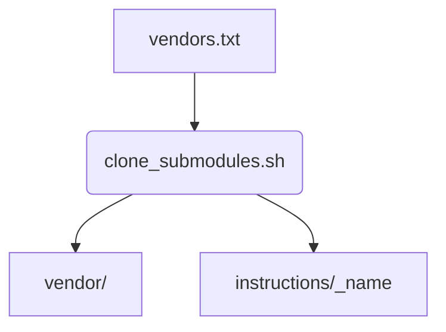

# clone_submodules.sh

This script clones all vendor repositories listed in `vendors.txt` or a custom template file. Each repository is checked out at the specified branch or tag. Any `instructions` folders from the vendors are copied into `instructions/_<name>/`.

