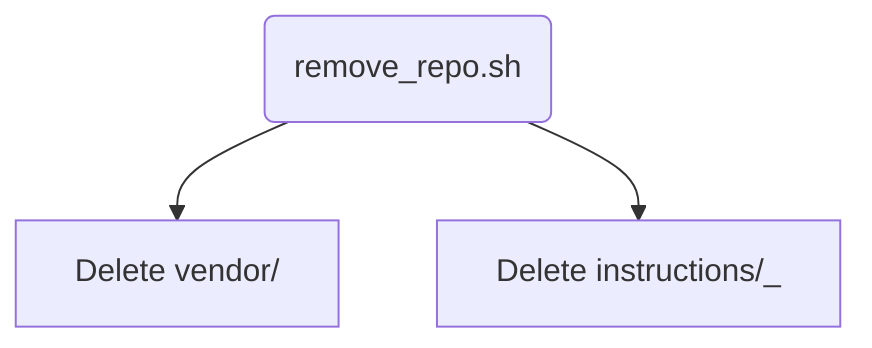

# remove_repo.sh

Safely remove a vendor repository directory and its instructions.

```mermaid
flowchart TD
    remove(remove_repo.sh) --> vendor_dir[Delete vendor/<name>]
    remove --> instr_dir[Delete instructions/_<name>]
```
