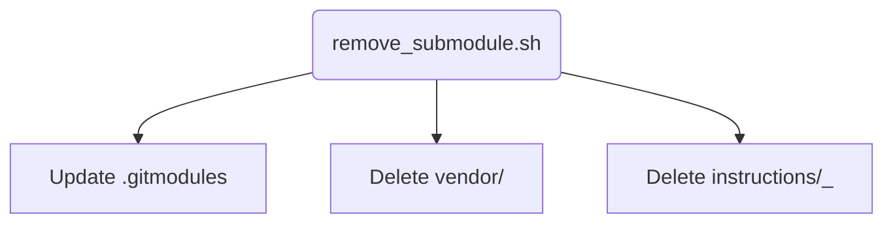

# remove_submodule.sh

Safely remove a vendor submodule and its instructions directory.

```mermaid
flowchart TD
    remove(remove_submodule.sh) --> gitops[Update .gitmodules]
    remove --> vendor_dir[Delete vendor/<name>]
    remove --> instr_dir[Delete instructions/_<name>]
```
