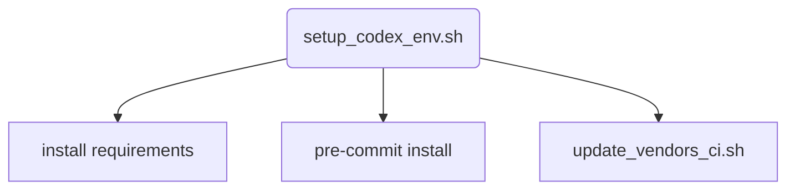

# setup_codex_env.sh

Prepare a Codex execution environment. It installs dependencies, installs pre‑commit hooks and runs `update_vendors_ci.sh`.

```mermaid
flowchart TD
    setup(setup_codex_env.sh) --> deps[install requirements]
    setup --> hooks[pre-commit install]
    setup --> update[update_vendors_ci.sh]
```
