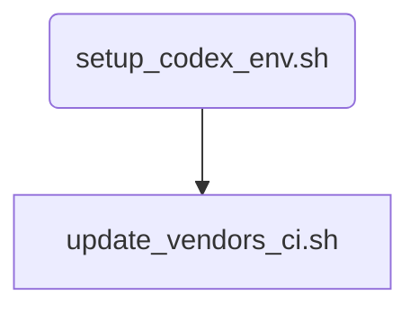

# setup_codex_env.sh

Prepare a Codex execution environment. It configures GitHub credentials, initializes git submodules and runs `update_vendors_ci.sh`.

```mermaid
flowchart TD
    setup(setup_codex_env.sh) --> update[update_vendors_ci.sh]
```
