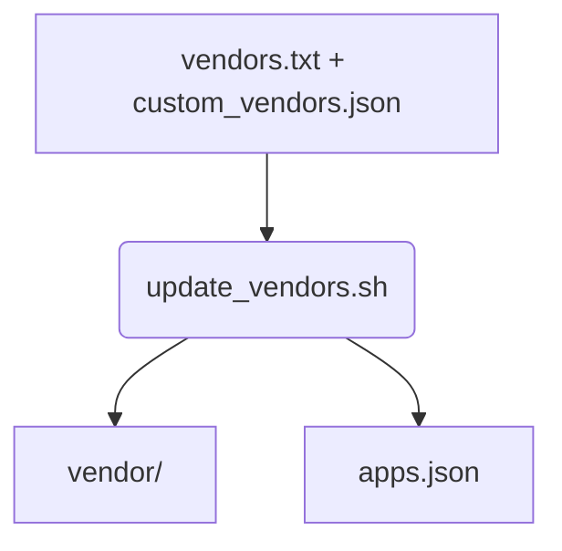

# update_vendors.sh

Synchronise vendor submodules based on `vendors.txt` and `custom_vendors.json`. The script requires `jq` for JSON handling. Instruction folders for active vendors are mirrored to `instructions/<slug>`. See [vendor_management.md](vendor_management.md) for details.

