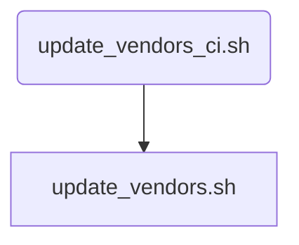

# update_vendors_ci.sh

Non-interactive wrapper for `update_vendors.sh`. It requires `GITHUB_TOKEN` and sets `GIT_TERMINAL_PROMPT=0` so that vendor repositories can be updated automatically.

```mermaid
flowchart TD
    ci(update_vendors_ci.sh) --> vendors[update_vendors.sh]
```
