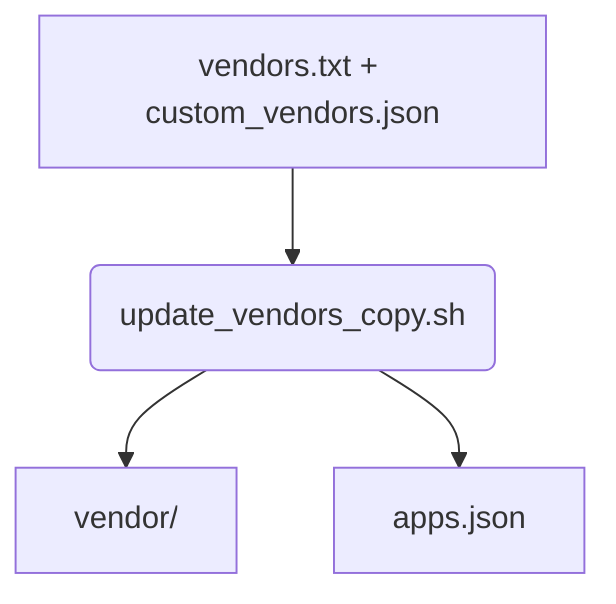

# update_vendors_copy.sh

Variant of `update_vendors.sh` that clones vendor repositories and stores them as normal directories without git metadata. Use this when you prefer not to keep submodules. It reads `GITHUB_TOKEN` or `API_KEY` from the project and bench `.env` files (or `.config/github_api.json`) so private repositories can be accessed automatically.

