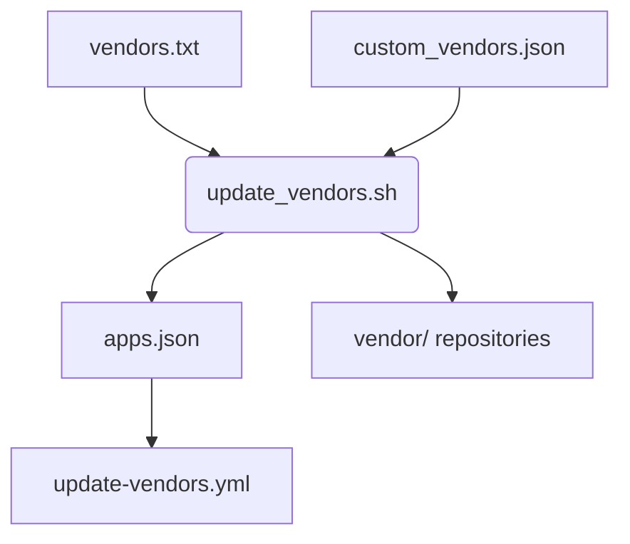

# Vendor Management

This document explains how vendor repositories are integrated into your app without using git submodules.

## Files

- `vendors.txt` – lists common vendor slugs. Profiles for those vendors are stored in `frappe_app_template/instructions/vendor_profiles/`.
- `custom_vendors.json` – allows you to specify additional repositories or override those from the profiles.
- `apps.json` – generated by `update_vendors.sh`; records the exact repository, branch or tag and commit of each installed vendor.

## Script: `update_vendors.sh`

The script reads both `vendors.txt` and `custom_vendors.json`, resolves the repository URL and ref from the vendor profiles and clones every entry directly under the `vendor/` directory. If a vendor repository is private, `update_vendors.sh` tries the GitHub token from the bench `.env` or `.config/github_api.json`. Should cloning fail, the script prompts you for a token on the command line. `update_vendors.sh` depends on `jq` for parsing JSON, so ensure it is installed before running the script.

Vendor directories removed from the lists are deleted, and the updated state is written back to `apps.json`.

Whenever a vendor is processed, its instruction directory from the profile is
mirrored to `instructions/<slug>` in your app. The `vendor_profiles` directory
is not copied into the project.

## Other helper scripts

- `clone_submodules.sh` – clones vendor repositories listed in `vendors.txt` without updating existing entries.
- `remove_submodule.sh` – removes a specific vendor repository directory and its instructions.

Both scripts live in the `scripts/` folder and are useful for manual vendor maintenance.

## GitHub Workflow

`update-vendors.yml` triggers `update_vendors.sh` automatically whenever `vendors.txt` or `custom_vendors.json` change. The workflow commits updated vendor directories and documentation back to the repository.

## Diagram

A high level flow of the vendor update process is captured in `vendor_update_flow.mmd`. Run `./scripts/generate_diagrams.sh` to render the diagram as SVG.

