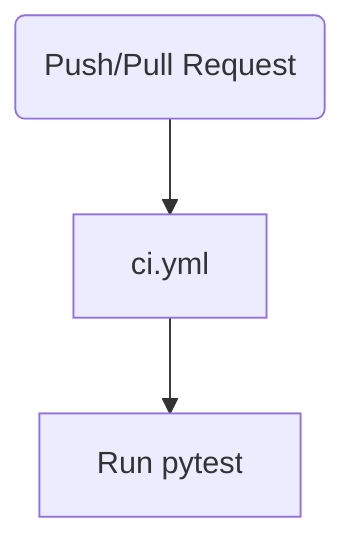

# ci.yml

Runs the project tests using Python and pytest. Use it as a base for your own CI.

```mermaid
flowchart TD
    push(Push/Pull Request) --> test_job[ci.yml]
    test_job --> pytest[Run pytest]
```
