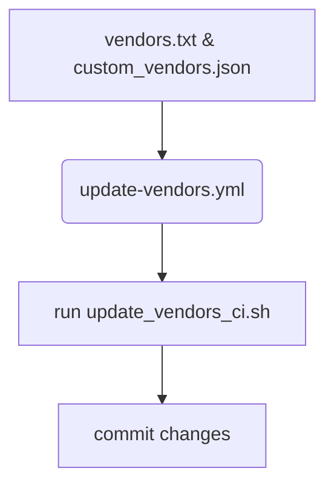

# update-vendors.yml

Watches `vendors.txt` and `custom_vendors.json` to keep vendor repositories in sync. It calls `update_vendors_ci.sh` to run the update without prompting for credentials.

```mermaid
flowchart TD
    files[vendors.txt & custom_vendors.json] --> workflow(update-vendors.yml)
    workflow --> script[run update_vendors_ci.sh]
    script --> commit[commit changes]
```
