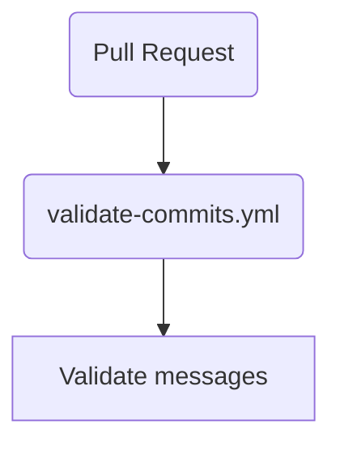

# validate-commits.yml

Checks commit messages against the Conventional Commits pattern.

```mermaid
flowchart TD
    pr(Pull Request) --> validate(validate-commits.yml)
    validate --> check[Validate messages]
```
